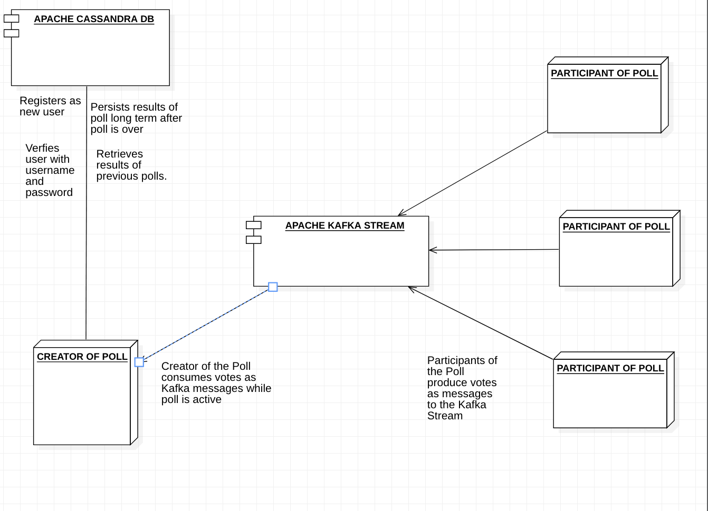
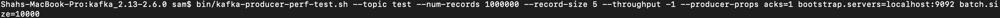
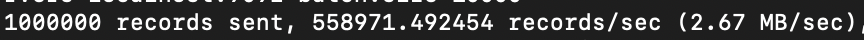
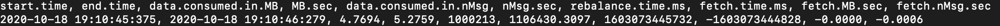
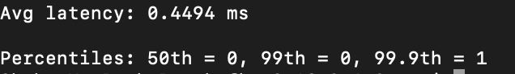

# Kpoll
Version 0.0.1

# Table of Contents
- [Overview](#overview)
- [Architecture](#architecture)
- [Kafka-Benchmarks](#kafka-benchmarks)
- [License](#license)
- [Use-Cases](#use-cases)
- [Technologies-Used](#technologies-used)
- [Future](#future)
- [Contact-and-Contributions](#contact-and-contributions)

# Overview
Kpoll is a distributed, highly scalable, real-time, fault tolerant polling service. It is a product that is ideally used for gathering data via a poll or a survey. Where there are many participants of the poll/survey that are voting in a small amount of time. Kpoll also strives to provide creators/moderators/authors of surveys the ability to monitor changes in reuslt in real time. The product is still in it's infancy and unfortunately only has a simple terminal program for interface. We hope to create a proper GUI's through the combination of creating both web and mobile applications.

# Architecture
The Architecture of kpoll, uses a variety of distributed services. Namely Apache Kafka and Apache Cassandra. 
An Apache Cassandra Server for users and polls have been created using Python3, Flask, and Apache Cassandra. The intent of the use of Cassandra is to store data long term. Apache Cassandra was chosen ahead of other databases due to the following reasons:

- Scalability: Provides linear scalability of resources due to the fact that Cassandra is NoSQL database that scales horizontally 

- Fault tolerance: Data is replicated across nodes and data centers in Apache Cassandra which provides no single point of failure and increased fault tolerance 

- Performance: Fast writes due to the Cassandra storage engine using log-structured merge trees

- Availability: Peer to peer architecture of multiple nodes, combined with the use of a distributed hash table, allows Cassandra to be highly available

Apache Kafka was used in this project to provide real-time feedback for authors/creators of polls and to decrease the load on the Cassandra server. Code for the Apache Kafka consumers and producers have been written in Python3. Apache Kafka is an open source event streaming service. In addition to being fault tolerant, highly available, and horizontally scalable like Apache Cassandra, the two main benefits that Kafka provides to this project are:

- Sustainable Low Latency: Kakfa provides low latency without using Random Access Memory by using Sequential I/O and the Zero Copy Principle

- High Throrughput: There are many reasons that contribute to Kakfa's high throughput including the use of Linux OS page cache and batching of multiple messages

Like many projects Kpoll, uses Apache Zookeeper in tandem with Apache Kafka. Apahce Zookeeper is used to keep track of Apache Kafka nodes, topics, and partitions.

# Kafka-Benchmarks
Initial Kafka Benchmark Testing has been done on my local machine, a 2017 Macbook Pro with the following specs:
   - Processor: 2.3GHz dual-core Intel Core i5, Turbo Boost up to 3.6GHz, with 64MB of eDRAM
   - Storage: 128GB
   - Memory: 8GB of 2133MHz LPDDR3 onboard memory 

1. Producer Throughput
The throughput of the kafka producer(voter of a poll) was tested using the kafka-producer-perf-test.sh script. A million records were sent in this test, each the size of 5 bytes.

The results below show a producer throughput of 2.67 Mb/sec

2. Consumer Throughput
The throughput of the consumer(creator of a poll) was tested using the kafka-consumer-perf-test.sh script. A million records were recieved, each of size 5 bytes.

The results below show a consumer throughput of 5.28 Mb/sec

3. End to End Latency
The End to End Latency Script tests the time taken for the producer to send a record to the kafka stream and for the kafka stream to make that record ready for consumption. The following test was run with a million records, each of size 5 bytes.

The results below show an average end to end latency of 0.45 ms

# License
This projects is currently under the Apache License. Please check below for details.

Copyright 2020 Shah Samiur Rahman

Licensed under the Apache License, Version 2.0 (the "License");
you may not use this file except in compliance with the License.
You may obtain a copy of the License at

    http://www.apache.org/licenses/LICENSE-2.0

Unless required by applicable law or agreed to in writing, software
distributed under the License is distributed on an "AS IS" BASIS,
WITHOUT WARRANTIES OR CONDITIONS OF ANY KIND, either express or implied.
See the License for the specific language governing permissions and
limitations under the License.

# Use-Cases
Like I previously mentioned, Kpoll is ideal in a scenario where there are many voters who are voting within a short period of time and also where the creator of the poll requires the data both in real-time and also needs to store it long term.

An example that springs to mind is that of a tech conference. Suppose you are hosting a tech conference with millions of developers present. You need to move forward with the conference and show a demo based on the languages and/or frameworks that the audience is familiar with. You need this data real time to move forward with the conference. You also need this data long term to dictate what language/framework is worth prioritizing for your product and what is not. Kpoll is a service that was built to address issues similar to the provided ficticious example.

# Technologies-Used
This project uses the following technologies:
- Python3
- Apache Cassandra
- Apache Kafka
- Apache Zookeeper

# Future
- Backend: In the long term I hope to have multiple cassandra clusters and multiple kafka brokers spread throughout machines and datacenters. For the shorterm I would need at least a few (2 - 4) servers to get the product launched in a beta stage. This is a step that is being carefully considered at the moment and is currently being hindered due to a lack of finances. Popular options such as Amazon's AWS and Microsoft's Azure are being considered, alongside less popular options such as renting physical servers.

- Frontend: As previously mentioned proper User Interfaces are a must for the future of this project. I do not expect or want future customers to be using a terminal program. I am currently considering building a webapp using React and mobile apps for both the iOS and Android platforms using React Native.

- Infrastructure-tool: I am currently also considering using the technologies and lessons that I have learned from this project to create an infrastructure tool for the real time monitoring of servers.

# Contact-and-Contributions
For further questions please contact me with the information below. 
- Email: samiur1998@gmail.com, srahma02@calpoly.edu
- LinkedIn: https://www.linkedin.com/in/shahsamiurrahman/

If you want to add to this project and make a contribution, please feel free to do so by:
1. Creating a github issue.
2. Forking the repo.
3. Creating a subsequent PR.

